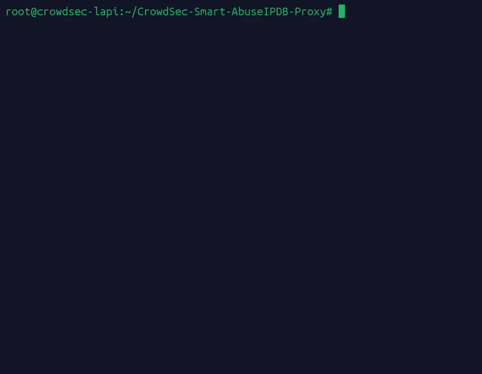
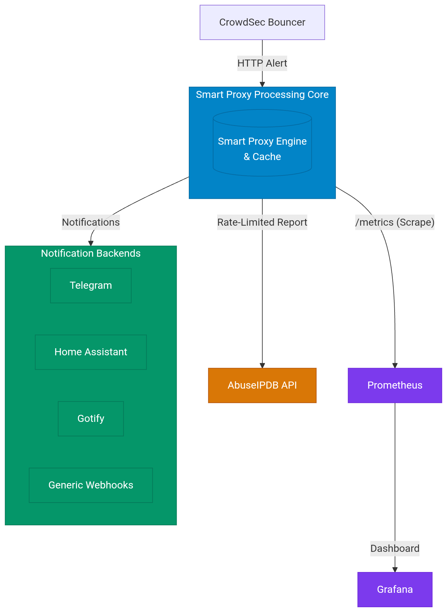

# CrowdSec Smart AbuseIPDB Proxy

[](https://github.com/PumbaLP/CrowdSec-Smart-AbuseIPDB-Proxy/actions/workflows/ci.yml)
[](https://github.com/PumbaLP/CrowdSec-Smart-AbuseIPDB-Proxy/releases/latest)


🇩🇪 Deutsch | 🇬🇧 [English](README.md)

Ein schlanker lokaler Proxy, der CrowdSec-Alerts intelligent an AbuseIPDB weiterleitet – mit Deduplizierung, Severity-Escalation und Rate-Limit-Schutz, damit du nicht wegen Spam-Reports von AbuseIPDB eingeschränkt wirst.

<p align="center">
  
</p>

<details>
<summary><strong>Inhaltsverzeichnis</strong></summary>

- [Das Problem](#das-problem)
- [Die Lösung](#die-lösung)
  - [Severity-Einstufung](#severity-einstufung)
- [Architektur](#architektur)
- [Voraussetzungen](#voraussetzungen)
- [Installation](#installation)
  - [Aktualisieren](#aktualisieren)
  - [Erneutes Ausführen / Key ändern](#erneutes-ausführen--key-ändern)
- [Deinstallation](#deinstallation)
- [Docker](#docker)
  - [Aktualisieren](#aktualisieren-1)
- [Konfiguration](#konfiguration-optional-per-umgebungsvariable)
- [Logs](#logs)
- [Sprache von Skripten und Meldungen](#sprache-von-skripten-und-meldungen)
- [Log-Volumen (Honeypots / High-Traffic-Setups)](#log-volumen-honeypots--high-traffic-setups)
- [CLI-Referenz](#cli-referenz)
- [Endpoints](#endpoints)
- [Alarme](#alarme-optional)
- [CrowdSec-Decision-Reconciliation](#crowdsec-decision-reconciliation-optional)
- [Versionshistorie](#versionshistorie)
- [Dateien im Repo](#dateien-im-repo)
- [Bekannte Einschränkungen](#bekannte-einschränkungen)
- [Contributing](#contributing)

</details>

## Das Problem

CrowdSec kann Alerts direkt per HTTP-Notification an AbuseIPDB melden. Das Problem: Wird eine IP mehrfach kurz hintereinander erkannt (z. B. SSH-Bruteforce, kurz danach ein Web-Exploit-Versuch), feuert CrowdSec für jeden einzelnen Alert einen Report. AbuseIPDB limitiert die API aber recht knapp, und wiederholte Reports derselben IP innerhalb kurzer Zeit bringen keinen echten Mehrwert – sie verschwenden nur dein Kontingent.

## Die Lösung

Dieser Proxy sitzt zwischen CrowdSec und AbuseIPDB und trifft für jede IP eine einfache Entscheidung:

- **Neue IP?** → Sofort melden.
- **IP wurde in den letzten 24h schon gemeldet?**
  - Alert mit **gleicher oder niedrigerer Severity** → wird ignoriert (kein Mehrwert).
  - Alert mit **höherer Severity** (z. B. von Port-Scan zu Exploit-Versuch):
    - Sind seit dem letzten Report bereits **≥ 15 Minuten** vergangen → sofort neu melden.
    - Sonst → Report wird **verzögert nachgeholt**, sobald die 15 Minuten voll sind (kein Spam, aber die Eskalation geht trotzdem nicht verloren).

So bekommt AbuseIPDB pro IP maximal einen Report pro 15-Minuten-Fenster, aber eine echte Eskalation geht nie unter.

### Severity-Einstufung

Basierend auf [AbuseIPDBs vollständiger Kategorienliste](https://www.abuseipdb.com/categories), gemappt auf eine interne Severity für Dedup und Eskalation:

| Severity | Kategorien |
|---|---|
| 1 (niedrig) | Open Proxy, Web Spam, Email Spam, Blog Spam, VPN IP, Port Scan, Bad Web Bot |
| 2 (mittel) | Fraud Orders, FTP Brute-Force, Ping of Death, Fraud VoIP, Spoofing, Brute-Force, Web App Attack, SSH, IoT Targeted |
| 3 (hoch) | DNS Compromise, DNS Poisoning, DDoS Attack, Phishing, Hacking, SQL Injection, Exploited Host |

Das CrowdSec-Notification-Template (`abuseipdb.yaml`) mappt gängige Scenario-Namensmuster (`ssh`, `telnet`, `sqli`, `cve`, generische `-bf`-Suffixe usw.) automatisch auf die richtigen Kategorien – die vollständige Liste steht in der Datei selbst. Das Matching ist case-insensitiv.

## Architektur

```
CrowdSec Alert → HTTP-Notification-Plugin → lokaler Proxy (Port 9999) → AbuseIPDB API
```

Der Proxy lauscht ausschließlich auf `127.0.0.1`, ist also nicht von außen erreichbar.

<p align="center">
  
</p>

## Voraussetzungen

- CrowdSec mit aktiviertem [HTTP-Notification-Plugin](https://docs.crowdsec.net/docs/notification_plugins/http)
- Python 3 (keine externen Dependencies, nur Standardbibliothek)
- Ein [AbuseIPDB API-Key](https://www.abuseipdb.com/account/api)
- root-Rechte auf dem Zielhost

## Installation

```bash
git clone https://github.com/PumbaLP/CrowdSec-Smart-AbuseIPDB-Proxy.git
cd CrowdSec-Smart-AbuseIPDB-Proxy
sudo ./install.sh
```

Das Skript (Ausgaben auf Englisch, siehe Hinweis unten) fragt interaktiv nach deinem AbuseIPDB API-Key und übernimmt:

1. Kopieren des Proxy-Skripts nach `/usr/local/bin/abuseipdb_proxy.py`
2. Anlegen eines persistenten Cache-Verzeichnisses unter `/var/lib/abuseipdb-proxy`
3. Ablegen des API-Keys in `/etc/abuseipdb-proxy/abuseipdb-proxy.env` (chmod 600, nur root lesbar)
4. Installation des systemd-Service `abuseipdb-proxy.service`
5. Installation der CrowdSec-Notification nach `/etc/crowdsec/notifications/abuseipdb.yaml`
6. Aktivieren + Starten des Dienstes, Neuladen von CrowdSec

**Ein manueller Schritt bleibt bewusst übrig:** Die Notification muss in `/etc/crowdsec/profiles.yaml` referenziert werden, z. B.:

```yaml
notifications:
  - abuseipdb_default
```

Das Skript prüft, ob der Eintrag schon vorhanden ist, trägt ihn aber nicht automatisch ein, da `profiles.yaml` je nach Setup individuell aufgebaut sein kann.

### Aktualisieren

```bash
cd CrowdSec-Smart-AbuseIPDB-Proxy
./update.sh
```

**Upgrade von v1.x?** v2.0.0 hat das Standard-Cache-Backend von einer einzelnen JSON-Datei auf SQLite umgestellt; v3.0.0 macht SQLite zum *einzigen* Backend (`ABUSEIPDB_CACHE_BACKEND=json` wurde komplett entfernt – siehe CHANGELOG). Liegt deine `cache.json` genau dort, wo auch `cache.db` entstehen würde (der Standardpfad), wird sie beim ersten Start nach dem Upgrade automatisch importiert und zu `cache.json.migrated` umbenannt – als Backup behalten, nie gelöscht. Du musst nichts tun; im Log steht "Migration complete", falls du's bestätigt sehen willst. Liegt deine `cache.json` stattdessen unter einem eigenen `ABUSEIPDB_CACHE_FILE`-Pfad, migrier sie explizit: `abuseipdb_proxy.py --migrate-to-sqlite /pfad/zur/alten/cache.json`.

Prüft auf neue Commits in `origin/main`, bricht ab, falls du lokal uncommittete Änderungen hast, zeigt was sich ändert (inklusive dem passenden `CHANGELOG.md`-Abschnitt, falls sich die Version geändert hat), zieht dann und stößt `install.sh` für dich an. Jederzeit gefahrlos ausführbar – macht nichts, falls du eh schon aktuell bist. Mit `-y` überspringst du die Bestätigungsabfrage (z. B. für einen Cronjob).

**Willst du nur benachrichtigt werden, statt automatisch zu aktualisieren?** Nutze `./update.sh --check-only` – prüft nur und schickt, falls es was Neues gibt, eine Benachrichtigung über den bereits konfigurierten Alarm-Mechanismus (siehe unten), ohne etwas zu verändern. `install.sh` bietet an, dafür einen täglichen systemd-Timer (`abuseipdb-proxy-update-check.timer`) einzurichten – so bekommst du einen Hinweis, ohne dass bei einem sicherheitsrelevanten Tool je unbeaufsichtigt automatisch etwas angewendet wird.

**Willst du das lieber in dein eigenes Tooling einspeisen?** Mit `--json` (nur zusammen mit `--check-only` gültig) gibt's statt der Textausgabe ein einzeiliges, maschinenlesbares Ergebnis:
```bash
./update.sh --check-only --json
# {"update_available": true, "current_version": "1.5.0", "new_version": "1.6.1", "commit_count": 3, "notified": true}
```

Was aktuell wirklich läuft, kannst du jederzeit prüfen mit:
```bash
abuseipdb_proxy.py --version
```

### Erneutes Ausführen / Key ändern

`install.sh` ist auch direkt idempotent aufrufbar. Läuft bereits ein Key unter `/etc/abuseipdb-proxy/abuseipdb-proxy.env`, fragt das Skript, ob er beibehalten oder überschrieben werden soll.

## Deinstallation

```bash
sudo ./uninstall.sh
```

Entfernt alles, was `install.sh` angelegt hat (Service, Binary, Config, Cache, CrowdSec-Notification), mit der Option, API-Key und Cache zu behalten, falls du später wieder installieren willst. Lässt `profiles.yaml` unangetastet – den `abuseipdb_default`-Eintrag danach von Hand entfernen.

## Docker

Eine Alternative zu `install.sh`, für alle, die CrowdSec schon (oder demnächst) containerisiert betreiben. Alles Docker-Bezogene liegt in `Docker/`, getrennt von der Bare-Metal-Installation im Repo-Root. Fertige Multi-Arch-Images (`linux/amd64`, `linux/arm64` – Raspberry Pi inklusive) werden bei jedem Release nach GHCR veröffentlicht; kein lokaler Build nötig. Das Image hat keine Drittanbieter-Python-Abhängigkeiten – der Proxy ist rein Standard-Library – daher ein kleines, normales `python:3.13-alpine`-Build ohne zusätzliche Pakete; CI baut es bei jedem Push und meldet die tatsächliche Größe. Auch der Ressourcenverbrauch zur Laufzeit ist minimal: in der Praxis deutlich unter 64MB RAM bei gelegentlichen Alerts (siehe die auskommentierten `mem_limit`/`cpus` in `Docker/docker-compose.yml`, falls du trotzdem eine harte Grenze willst).

```bash
cd Docker
cp docker-compose.env.example docker-compose.env
# docker-compose.env bearbeiten: mindestens ABUSEIPDB_API_KEY setzen
docker compose up -d
```

Das war's – `Docker/docker-compose.yml` zieht das veröffentlichte Image (`ghcr.io/pumbalp/crowdsec-smart-abuseipdb-proxy:latest`), bei jedem Release automatisch gebaut und gepusht; nichts lokal zu bauen. Alle `docker compose`-Befehle von innerhalb `Docker/` ausführen (oder vom Repo-Root aus `-f Docker/docker-compose.yml` anhängen) – so wird `docker-compose.env` relativ zum eigenen Speicherort aufgelöst. Du willst am Dockerfile selbst mitentwickeln? Siehe `CONTRIBUTING.md`, wie du's lokal baust und testest.

**Image verifizieren**: jedes veröffentlichte Image ist signiert (keyless, über [cosign](https://github.com/sigstore/cosign) und Sigstore) und liefert eine SPDX-SBOM mit, beides in CI angehängt. Zum Verifizieren nach dem Pull:
```bash
cosign verify ghcr.io/pumbalp/crowdsec-smart-abuseipdb-proxy:latest \
  --certificate-identity-regexp "^https://github.com/PumbaLP/CrowdSec-Smart-AbuseIPDB-Proxy" \
  --certificate-oidc-issuer https://token.actions.githubusercontent.com
```

Ein paar Dinge unterscheiden sich von der Bare-Metal-Installation:

- **Netzwerk**: Der Container lauscht innerhalb der Docker-eigenen Netzwerkisolation auf `0.0.0.0:9999` (standardmäßig nicht an den Host durchgereicht – siehe den auskommentierten `ports:`-Block in `docker-compose.yml`, falls du das wirklich brauchst). CrowdSec muss diesen Container über seinen Docker-Servicenamen erreichen, nicht über `127.0.0.1`: die `url` in `abuseipdb.yaml` auf `http://abuseipdb-proxy:9999/` ändern, und sicherstellen, dass CrowdSecs eigener Container im selben Docker-Netzwerk hängt – siehe die `networks:`-Kommentare in `docker-compose.yml`, um einem bestehenden CrowdSec-Compose-Projekt beizutreten.
- **Cache**: liegt in einem benannten Docker-Volume (`abuseipdb-cache`), nicht unter `/var/lib/abuseipdb-proxy` auf dem Host. `docker compose down` allein rührt das nicht an; `docker compose down -v` schon.
- **Das CrowdSec-seitige Setup** (`abuseipdb.yaml`, `profiles.yaml`) bleibt in beiden Fällen gleich – das hier ersetzt nur, wie der Proxy selbst läuft, nicht wie CrowdSec mit ihm spricht (abgesehen von der URL oben).
- **CLI-Flags** (`--stats`, `--vacuum`, `--export`, `--test-notify`, `--reconcile`, …) funktionieren weiterhin: `docker compose exec abuseipdb-proxy python3 abuseipdb_proxy.py --stats`, usw.
- **`--reconcile`**: Der in diesem Repo enthaltene systemd-Timer (`abuseipdb-proxy-reconcile.timer`) ist Bare-Metal-only. Für Docker stattdessen selbst per Host-Cron planen, z. B. stündlich: `0 * * * * cd /pfad/zu/Docker && docker compose exec -T abuseipdb-proxy python3 abuseipdb_proxy.py --reconcile`. Außerdem `ABUSEIPDB_CROWDSEC_LAPI_URL` auf die tatsächlich von diesem Container aus erreichbare CrowdSec-Adresse setzen – `http://127.0.0.1:8080` (der Default) stimmt in Docker so gut wie nie; typischerweise `http://crowdsec:8080`, falls im selben Docker-Netzwerk (siehe „Netzwerk" oben zum Beitreten von CrowdSecs Netzwerk).
- **Secrets**: jeder `{VARIABLE}_FILE`-Override (siehe „Konfiguration" oben) funktioniert auch in Docker – `docker-compose.yml` hat dafür ein auskommentiertes Beispiel-Volume.

### Aktualisieren

Manuell, von innerhalb `Docker/`: `docker compose pull && docker compose up -d`. (`update.sh`/`--check-only` gehen von einem Bare-Metal-Git-Checkout aus und gelten für das Docker-Setup nicht.)

**Lieber Set-and-forget?** `Docker/docker-compose.yml` enthält einen auskommentierten [Watchtower](https://containrrr.dev/watchtower/)-Service, gezielt auf diesen Container beschränkt (per Label, damit nichts anderes Docker-Basiertes auf demselben Host angefasst wird). Auskommentieren, fertig – prüft standardmäßig täglich. Läuft per Default mit `WATCHTOWER_MONITOR_ONLY=true`: schickt eine Benachrichtigung, wenn ein Update verfügbar ist, wendet es aber nicht automatisch an – dieselbe „sag mir Bescheid, mach's nicht einfach"-Philosophie wie `update.sh --check-only` bei der Bare-Metal-Installation. `WATCHTOWER_NOTIFICATION_URL` auf denselben Alarm-Mechanismus zeigen lassen, den du schon für den Proxy konfiguriert hast (Watchtower nutzt [shoutrrr](https://containrrr.dev/shoutrrr/)-URLs – Slack/Discord/Gotify/ntfy und mehr werden unterstützt, nur in einem anderen URL-Format als die `ABUSEIPDB_*`-Variablen des Proxys selbst). Soll es tatsächlich automatisch anwenden? Die `WATCHTOWER_MONITOR_ONLY`-Zeile löschen.

Image-Tags: `latest` (neuestes Release), `X.Y.Z`/`X.Y`/`X` (auf eine bestimmte Version pinnen oder einer Major-/Minor-Linie folgen), oder `sha-<commit>` (exakte Build-Herkunft).

## Konfiguration (optional, per Umgebungsvariable)

Alle in `/etc/abuseipdb-proxy/abuseipdb-proxy.env`:

Jede unten aufgeführte, secret-artige Variable (API-Key, Tokens, Webhook-URLs, das Shared Secret) akzeptiert zusätzlich einen `{VARIABLE}_FILE`-Override – statt des Werts selbst einen Dateipfad in die Env-Datei setzen, für Docker/Podman-Secrets oder ein Mount aus einem Secrets-Manager. Sind beide gesetzt, gewinnt `_FILE`. Siehe `abuseipdb-proxy.env.example` / `Docker/docker-compose.env.example`.

| Variable | Default | Beschreibung |
|---|---|---|
| `ABUSEIPDB_API_KEY` | *(erforderlich)* | Dein AbuseIPDB API-Key |
| `ABUSEIPDB_PROXY_PORT` | `9999` | Lokaler Port des Proxys |
| `ABUSEIPDB_LISTEN_ADDRESS` | `127.0.0.1` | Interface, an das gebunden wird. Nur in einer isolierten Umgebung vom Loopback-only-Default abweichen (z. B. innerhalb der Docker-eigenen Netzwerkisolation – siehe „Docker" oben); niemals direkt einem nicht vertrauenswürdigen Netz aussetzen. |
| `ABUSEIPDB_CACHE_FILE` | `/var/lib/abuseipdb-proxy/cache.db` | Pfad zur SQLite-Cache-Datenbank |
| `ABUSEIPDB_SQLITE_JOURNAL_MODE` | `WAL` | SQLite-Journal-Modus. Der Standard ist bereits SSD-freundlich, selten änderungswürdig. Nur beim SQLite-Backend relevant. |
| `ABUSEIPDB_SQLITE_SYNCHRONOUS` | `NORMAL` | SQLite-Sync-Modus. `FULL` tauscht etwas Write-Amplification gegen mehr Haltbarkeit ein, falls du auf unzuverlässigem Storage (z. B. SD-Karte) unterwegs bist. Nur beim SQLite-Backend relevant. |
| `ABUSEIPDB_REPORT_WINDOW` | `905` | Standard-Zeitfenster in Sekunden zwischen Reports derselben IP |
| `ABUSEIPDB_REPORT_WINDOW_LOW` | wie `ABUSEIPDB_REPORT_WINDOW` | Fenster-Override für Alerts niedriger Severity |
| `ABUSEIPDB_REPORT_WINDOW_MEDIUM` | wie `ABUSEIPDB_REPORT_WINDOW` | Fenster-Override für Alerts mittlerer Severity |
| `ABUSEIPDB_REPORT_WINDOW_HIGH` | wie `ABUSEIPDB_REPORT_WINDOW` | Fenster-Override für Alerts hoher Severity |
| `ABUSEIPDB_REPORT_WINDOW_CATEGORIES` | *(leer)* | Kommagetrennte `kategorie=sekunden`-Overrides für einzelne AbuseIPDB-Kategorien (z. B. `16=1800,20=3600`), feiner als die Severity-Stufen oben. Gewinnt gegenüber dem Severity-Fenster, sobald eine gemeldete Kategorie matcht; bei mehreren treffenden Kategorien gilt das kürzeste Fenster. |
| `ABUSEIPDB_MAX_RETRIES` | `3` | Wie oft ein fehlgeschlagener Report wiederholt wird, bevor aufgegeben wird |
| `ABUSEIPDB_RETRY_DELAY` | `900` | Wartezeit in Sekunden vor einem Retry (wird durch den `Retry-After`-Header der API überschrieben, falls vorhanden, z. B. bei einem 429) |
| `ABUSEIPDB_DRY_RUN` | `false` | Bei `true` wird nur geloggt, was gemeldet würde, ohne die AbuseIPDB-API aufzurufen. Lässt sich auch pro Lauf mit `--dry-run` setzen. |
| `ABUSEIPDB_IGNORE_PRIVATE` | `true` | Bei `true` werden RFC1918-/Loopback-/Link-Local-/CGNAT-Adressen stillschweigend übersprungen (nie sinnvoll zu melden), ebenso die RFC-5737-/RFC-3849-Dokumentations-Ranges (192.0.2.0/24, 198.51.100.0/24, 203.0.113.0/24, 2001:db8::/32 – nie einem echten Host zugewiesen, also nie ein echter Angreifer). Deckt auch Tailscales 100.64.0.0/10-Bereich ab. |
| `ABUSEIPDB_IGNORE_IPS` | *(leer)* | Zusätzliche, kommagetrennte IPs/CIDRs, die immer übersprungen werden, zusätzlich zu den eingebauten privaten Bereichen |
| `ABUSEIPDB_ALLOWED_SOURCE_IPS` | *(leer)* | Kommagetrennte IPs/CIDRs, die auf den Proxy posten dürfen. Leer bedeutet: keine Allowlist aktiv (aktuelles Verhalten unverändert). Eine zusätzliche Schicht neben `ABUSEIPDB_LISTEN_ADDRESS`, vor allem sinnvoll, wenn der Listener nicht Loopback-only ist. |
| `ABUSEIPDB_SHARED_SECRET` | *(leer)* | Falls gesetzt, müssen eingehende POSTs einen passenden `X-Proxy-Secret`-Header mitschicken (siehe das auskommentierte Beispiel in `abuseipdb.yaml`). Leer bedeutet: kein Secret erforderlich (aktuelles Verhalten unverändert). |
| `ABUSEIPDB_MAX_CONCURRENT_REQUESTS` | `50` | Sicherheitsnetz, keine normale Drosselung: begrenzt, wie viele Requests der Proxy gleichzeitig bearbeitet (jeder bekommt einen eigenen Thread). `0` deaktiviert das Limit. Lehnt bei Überschreitung sofort mit `503` ab statt zu warten – gedacht für eine echte Fehlkonfiguration/Bug, nicht um normale Bursts abzufedern. |
| `ABUSEIPDB_QUOTA_RESERVE_MEDIUM` | `0` | Reserviert so viele der heute noch verbleibenden AbuseIPDB-Reports für Severity 2 und höher – Severity-1-Reports werden zurückgehalten, sobald das Restkontingent auf diesen Wert oder darunter fällt. `0` deaktiviert die Reservierung. Wirkt erst, sobald der Proxy tatsächlich ein Restkontingent von AbuseIPDB gesehen hat. |
| `ABUSEIPDB_QUOTA_RESERVE_HIGH` | `0` | Dasselbe, aber nur für Severity 3 – hält Severity 1 und 2 zurück, sobald das Restkontingent diesen Wert erreicht oder unterschreitet. Sollte normalerweise `<=` `ABUSEIPDB_QUOTA_RESERVE_MEDIUM` sein. `0` deaktiviert die Reservierung. |
| `ABUSEIPDB_SKIP_WHITELISTED` | `false` | Bei `true` werden IPs nicht gemeldet, die AbuseIPDBs eigener `/v2/check`-Endpoint als whitelisted markiert (z. B. bekannte Crawler/CDNs, die sich dafür angemeldet haben). Nutzt ein eigenes, von `/v2/report` getrenntes Tageskontingent und macht bei einem Cache-Miss einen synchronen Netzwerk-Call im Request-Pfad – siehe `ABUSEIPDB_WHITELIST_CACHE_TTL`. |
| `ABUSEIPDB_WHITELIST_CACHE_TTL` | `86400` | Sekunden, die das Whitelist-Ergebnis einer IP im Speicher gecacht wird, bevor erneut geprüft wird. Nur relevant bei `ABUSEIPDB_SKIP_WHITELISTED=true`. |
| `ABUSEIPDB_NOTIFY_NAME` | `CrowdSec Smart AbuseIPDB Proxy` | Anzeigename in Alarm-Benachrichtigungen |
| `ABUSEIPDB_GOTIFY_URL` | *(leer)* | Basis-URL deines Gotify-Servers, z. B. `https://gotify.example.com`. Aktiviert das Gotify-Backend, sobald dies und der Token unten gesetzt sind. |
| `ABUSEIPDB_GOTIFY_TOKEN` | *(leer)* | Gotify-Application-Token |
| `ABUSEIPDB_NTFY_URL` | *(leer)* | Vollständige ntfy-Topic-URL, z. B. `https://ntfy.example.com/my-topic`. Aktiviert das ntfy-Backend, sobald gesetzt. |
| `ABUSEIPDB_NTFY_TOKEN` | *(leer)* | Optionaler ntfy-Access-Token (für geschützte Topics) |
| `ABUSEIPDB_WEBHOOK_URL` | *(leer)* | Generischer JSON-Webhook für alles, was nicht nativ unterstützt wird – erhält `{"name", "message", "priority"}` |
| `ABUSEIPDB_SLACK_WEBHOOK_URL` | *(leer)* | Slack-Incoming-Webhook-URL. Aktiviert das Slack-Backend, sobald gesetzt. |
| `ABUSEIPDB_DISCORD_WEBHOOK_URL` | *(leer)* | Discord-Channel-Webhook-URL. Aktiviert das Discord-Backend, sobald gesetzt. |
| `ABUSEIPDB_MATRIX_HOMESERVER_URL` | *(leer)* | Matrix-Homeserver-URL, z. B. `https://matrix.org`. Alle drei Matrix-Variablen sind zusammen erforderlich. |
| `ABUSEIPDB_MATRIX_ACCESS_TOKEN` | *(leer)* | Access-Token für den Matrix-Account, mit dem der Proxy postet |
| `ABUSEIPDB_MATRIX_ROOM_ID` | *(leer)* | Raum-ID, in die gepostet wird, z. B. `!roomid:matrix.org` – der Account oben muss bereits Mitglied sein |
| `ABUSEIPDB_TELEGRAM_BOT_TOKEN` | *(leer)* | Telegram-Bot-Token von [@BotFather](https://t.me/BotFather). Aktiviert das Telegram-Backend, sobald zusammen mit der Chat-ID gesetzt. |
| `ABUSEIPDB_TELEGRAM_CHAT_ID` | *(leer)* | Telegram-Chat-ID, an die gesendet wird |
| `ABUSEIPDB_HOMEASSISTANT_URL` | *(leer)* | Home-Assistant-Basis-URL, z. B. `https://homeassistant.local:8123`. Diese und der Token sind zusammen nötig. |
| `ABUSEIPDB_HOMEASSISTANT_TOKEN` | *(leer)* | Long-Lived Access Token aus deinem HA-Benutzerprofil |
| `ABUSEIPDB_HOMEASSISTANT_NOTIFY_SERVICE` | `notify` | Welcher `notify.<service>` aufgerufen wird – `notify` ist der generische; z. B. `mobile_app_myphone` für ein bestimmtes Gerät |
| `ABUSEIPDB_BACKUP_RETENTION` | `14` | Wie viele zeitgestempelte Snapshots `--backup` behält, bevor die ältesten gelöscht werden |
| `ABUSEIPDB_VERBOSE_LOGGING` | `false` | Bei `true` wird pro erfolgreichem Report und pro ignorierter privater IP eine Zeile geloggt. Standardmäßig aus – siehe "Log-Volumen" unten. |
| `ABUSEIPDB_LOG_FORMAT` | `text` | `text` (die klassische `[abuseipdb-proxy] message`-Zeile) oder `json` (ein JSON-Objekt pro Zeile – Timestamp/Level/Message plus je nach Ereignis zusätzliche strukturierte Felder – für Loki/ELK/Graylog usw.) |
| `ABUSEIPDB_QUOTA_WARN_THRESHOLD` | `50` | Schickt einmal pro Tag eine Benachrichtigung (über einen konfigurierten Alarm-Mechanismus), sobald das tägliche AbuseIPDB-Report-Kontingent auf diesen Wert oder darunter fällt. Wird aus dem `X-RateLimit-Remaining`-Header der API mitgelesen – auch über `/health` und `/metrics` sichtbar. |
| `ABUSEIPDB_SUMMARY_INTERVAL` | `300` | Sekunden zwischen periodischen Summary-Log-Zeilen (Zähler für gesendet/unterdrückt/fehlgeschlagen/ignoriert). `0` deaktiviert es. |
| `ABUSEIPDB_ENABLE_HEALTH` | `false` | Auf `true` setzen, um den `/health`-Endpoint zu aktivieren |
| `ABUSEIPDB_ENABLE_METRICS` | `false` | Auf `true` setzen, um den `/metrics`-Endpoint zu aktivieren |
| `ABUSEIPDB_NOTIFY_ON_START` | `false` | Bei `true` wird bei jedem Start des Proxys eine Low-Priority-Benachrichtigung über jedes konfigurierte Alarm-Backend gesendet – praktisch, um zu bestätigen, dass ein Update den Dienst wirklich neu gestartet hat |
| `ABUSEIPDB_COMMENT_SCRUB_PATTERNS` | *(leer)* | Semikolon-getrennte Regexes (nicht Komma – Regexes enthalten oft selbst Kommas, z. B. `{2,4}`). Jeder Treffer im Kommentartext wird ersetzt, bevor der Report rausgeht – AbuseIPDB-Kommentare sind öffentlich. Ungültige Regexes werden geloggt und übersprungen, nicht fatal. |
| `ABUSEIPDB_COMMENT_SCRUB_REPLACEMENT` | `[redacted]` | Ersatztext für Treffer von `ABUSEIPDB_COMMENT_SCRUB_PATTERNS` |
| `ABUSEIPDB_API_KEY_FALLBACK` | *(leer)* | Ein zweiter AbuseIPDB-API-Key, auf den umgeschaltet wird, sobald das Tageskontingent des Primär-Keys erschöpft ist (erkannt über einen HTTP-429 auf `/v2/report`). Schaltet automatisch zurück auf den Primär-Key, sobald erstmals ein neuer UTC-Tag beobachtet wird. |
| `ABUSEIPDB_CROWDSEC_LAPI_URL` | `http://127.0.0.1:8080` | CrowdSecs lokale API-URL, nur von `--reconcile` genutzt |
| `ABUSEIPDB_CROWDSEC_BOUNCER_KEY` | *(leer)* | Bouncer-API-Key für `--reconcile` (erstellen mit `cscli bouncers add <name>` auf dem CrowdSec-Host). `--reconcile` tut ohne diesen Wert nichts. |
| `ABUSEIPDB_RECONCILE_SEVERITY` | `2` | Fallback-Severity für `--reconcile`, nur genutzt, wenn eine Decision gar keinen Scenario-Namen hat (z. B. manuell via `cscli decisions add` hinzugefügt) – sonst wird die Severity aus dem echten Scenario abgeleitet, genau wie bei einem Live-Alert |
| `ABUSEIPDB_RECONCILE_CATEGORIES` | `15` | Derselbe Fallback, für Kategorien |

## Logs

```bash
journalctl -u abuseipdb-proxy.service -f
```

Fehlgeschlagene Reports und Cache-Schreibfehler werden dort geloggt (vorher wurden Fehler beim API-Call stillschweigend verschluckt – das ist jetzt behoben).

Leitest du die Ausgabe des Proxys stattdessen in eine normale Datei um (statt journald oder Dockers Log-Treiber zu nutzen, die beide schon selbst rotieren)? `abuseipdb-proxy.logrotate` liefert eine fertige Config – siehe den Kommentar oben drin für die Ein-Zeilen-Installation.

## Sprache von Skripten und Meldungen

Code, Kommentare und alle Konsolen-/Log-Ausgaben (`install.sh`, `abuseipdb_proxy.py`, `.service`-Datei) sind bewusst komplett auf **Englisch** gehalten, wie bei öffentlichen GitHub-Projekten üblich. Nur diese README existiert zweisprachig.

## Log-Volumen (Honeypots / High-Traffic-Setups)

Standardmäßig bleibt der Proxy auch unter Last ruhig: Statt einer Log-Zeile pro Report gibt's eine periodische Summary-Zeile (Intervall über `ABUSEIPDB_SUMMARY_INTERVAL`, Default 300s), und auch die nur, wenn in dem Fenster tatsächlich was passiert ist. Retries, Give-ups und fehlgeschlagene Benachrichtigungen loggen weiterhin immer sofort – die sind naturgemäß selten, nicht volumengetrieben.

Für Detail-Logging pro Event beim Troubleshooten auf einem Host mit wenig Traffic: `ABUSEIPDB_VERBOSE_LOGGING=true` setzen.

Zwei zusätzliche Sicherheitsnetze, unabhängig vom eigenen Logging der App:

- **`abuseipdb-proxy.service`** setzt `LogRateLimitIntervalSec=30` / `LogRateLimitBurst=200`, deckelt den Dienst also auf maximal 200 Journal-Zeilen pro 30s, egal was passiert – schützt vor einem künftigen Logging-Bug oder einem ungewöhnlich gesprächigen CrowdSec-Szenario, ohne dass du dir selbst Gedanken machen musst.
- **journald selbst** hat globale Limits, die auf einem Honeypot-Host generell sinnvoll sind (nicht proxy-spezifisch): `SystemMaxUse=` / `RuntimeMaxUse=` in `/etc/systemd/journald.conf` deckeln die gesamte Disk-/RAM-Nutzung, und `Storage=persistent` vs. `volatile` entscheidet, ob Logs auf Disk oder nur in einem RAM-basierten tmpfs liegen. Lohnt sich, einmal zu prüfen, wenn dein Honeypot generell viel CrowdSec-Aktivität erzeugt.

## CLI-Referenz

Über den eigentlichen Proxy-Betrieb hinaus hat `abuseipdb_proxy.py` (bzw. `abuseipdb_proxy.py` im `$PATH`, einmal installiert) ein paar eigenständige Wartungs-Flags – alle lesen/schreiben direkt am Cache und beenden sich, keins davon startet den HTTP-Server:

| Flag | Was es macht |
|---|---|
| `--version` | Version ausgeben und beenden. |
| `--dry-run` | Loggt, was gemeldet würde, statt die AbuseIPDB-API aufzurufen (identisch zu `ABUSEIPDB_DRY_RUN=true`). |
| `--stats [--json] [--stats-limit N]` | Cache-Snapshot: aktuelle Reports, ausstehende Eskalationen, wartende Retries, AbuseIPDB-Kontingent. `--json` fürs Scripting; `--stats-limit` begrenzt die Recent-Reports-Liste (Standard 10). |
| `--export [PFAD]` | Cache als portables JSON nach PFAD exportieren, oder nach stdout falls weggelassen. |
| `--import PFAD [-y]` | Ersetzt den Cache durch einen JSON-Snapshot aus PFAD (oder `-` für stdin). Fragt nach Bestätigung, außer `-y`/`--yes`. |
| `--vacuum` | Räumt alte Reports auf und gibt im SQLite-Cache Speicherplatz frei. |
| `--backup [VERZ]` | Schreibt einen zeitgestempelten Cache-Snapshot nach VERZ (Standard: `backups/` neben der Cache-Datei), räumt danach alte Backups über `ABUSEIPDB_BACKUP_RETENTION` (Standard 14) hinaus auf. Passt für einen periodischen Timer. |
| `--check-config [--json]` | Validiert die Konfiguration (API-Key, Cache-Pfad, Alarm-Backends, Timing) ohne Netzwerkzugriff und ohne Änderungen. Exit-Code 1 bei Fehlern. |
| `--doctor [--no-network] [--json]` | Alles, was `--check-config` prüft, plus systemd-Service-Status, Dateiberechtigungen, CrowdSec-`profiles.yaml`-Verdrahtung, Cache-Lesbarkeit, ob api.abuseipdb.com erreichbar ist, und (außer bei `--no-network`) ein Live-Selbsttest – schickt einen synthetischen, immer gefilterten Test-Alert über den tatsächlich laufenden Proxy-Prozess und bestätigt, dass die deployte Instanz wirklich lauscht und funktioniert, nicht nur dass die Konfiguration dieses CLI-Aufrufs plausibel aussieht. Bare-Metal-spezifische Checks überspringen sich sauber außerhalb dieses Kontexts (z. B. in Docker). |
| `--test-notify` | Schickt eine Testnachricht an alle konfigurierten Alarm-Backends. |
| `--notify NACHRICHT [--notify-priority low\|normal\|high]` | Schickt eine beliebige Nachricht über die konfigurierten Alarm-Backends. Wird intern von `update.sh --check-only` genutzt. |
| `--reconcile [--json]` | Vergleicht CrowdSecs aktuell aktive Decisions mit dem Report-Cache des Proxys und meldet fehlende (siehe „CrowdSec-Decision-Reconciliation" unten). Passt für einen periodischen Timer. |
| `--migrate-to-sqlite SOURCE_JSON_FILE [--migrate-target PATH]` | Einmalige Migration weg vom JSON-Cache-Format, dessen Backend-Unterstützung in 3.0.0 komplett entfernt wurde: liest SOURCE_JSON_FILE (deine alte `cache.json`) und schreibt eine neue SQLite-Datenbank unter `--migrate-target` (Default: SOURCE_JSON_FILE mit `.db`-Endung), ohne die Quelldatei anzufassen oder zu löschen. Verweigert das Überschreiben einer bereits existierenden Zieldatei. |

## Endpoints

Neben dem CrowdSec-Webhook-Ziel (`POST /`) stellt der Proxy zwei read-only Endpoints auf demselben lokalen Port bereit:

- **`GET /health`** – JSON-Status: `{"status", "version", "dry_run", "uptime_seconds", "cache_reports_tracked", "pending_escalations", "pending_retries", "abuseipdb_quota"}`
- **`GET /metrics`** – Prometheus-Textformat: `abuseipdb_proxy_reports_sent_total`, `abuseipdb_proxy_reports_suppressed_total`, `abuseipdb_proxy_reports_failed_total`, `abuseipdb_proxy_reports_ignored_private_total`, `abuseipdb_proxy_reports_quota_reserved_total`, `abuseipdb_proxy_reports_whitelisted_total`, plus Gauges für ausstehende Eskalationen/Retries, Uptime und AbuseIPDB-Kontingent (Rest/Limit, sobald bekannt)

Beide sind **standardmäßig aus** und lauschen, einmal aktiviert, nur auf `127.0.0.1`. Aktivieren mit `ABUSEIPDB_ENABLE_HEALTH=true` / `ABUSEIPDB_ENABLE_METRICS=true`.

**Grafana**: ein fertiges Dashboard für `/metrics` liegt unter [`Grafana/dashboard.json`](Grafana/dashboard.json) – Report-Raten, ausstehende Eskalationen/Retries, Kontingent, Uptime. Siehe [`Grafana/README.md`](Grafana/README.md) für die Prometheus-Scrape-Config und Import-Schritte.

## Alarme (optional)

Falls du benachrichtigt werden willst, wenn wirklich was Aufmerksamkeit braucht – nicht bei jedem Report, sondern nur wenn der Proxy nach allen Retries endgültig aufgibt, oder wenn die Cache-Datei nicht geschrieben werden kann – konfigurier eine beliebige Kombination aus:

- **[Gotify](https://gotify.net/)**: `ABUSEIPDB_GOTIFY_URL` und `ABUSEIPDB_GOTIFY_TOKEN` setzen
- **[ntfy](https://ntfy.sh/)**: `ABUSEIPDB_NTFY_URL` setzen (und `ABUSEIPDB_NTFY_TOKEN`, falls das Topic geschützt ist)
- **Slack**: `ABUSEIPDB_SLACK_WEBHOOK_URL` auf eine [Incoming-Webhook](https://api.slack.com/messaging/webhooks)-URL setzen
- **Discord**: `ABUSEIPDB_DISCORD_WEBHOOK_URL` auf eine Channel-Webhook-URL setzen
- **[Matrix](https://matrix.org/)**: `ABUSEIPDB_MATRIX_HOMESERVER_URL`, `ABUSEIPDB_MATRIX_ACCESS_TOKEN` und `ABUSEIPDB_MATRIX_ROOM_ID` setzen (alle drei nötig – postet als Bot-User über die Client-Server-API, kein Webhook nötig; den Bot-Account vorher in den Raum einladen)
- **Telegram**: `ABUSEIPDB_TELEGRAM_BOT_TOKEN` (von [@BotFather](https://t.me/BotFather)) und `ABUSEIPDB_TELEGRAM_CHAT_ID` setzen
- **[Home Assistant](https://www.home-assistant.io/)**: `ABUSEIPDB_HOMEASSISTANT_URL` und `ABUSEIPDB_HOMEASSISTANT_TOKEN` setzen (ein [Long-Lived Access Token](https://www.home-assistant.io/docs/authentication/#your-account-profile) aus deinem HA-Benutzerprofil – ruft `notify.notify` nativ über die REST-API von HA auf, keine Bridge nötig; `ABUSEIPDB_HOMEASSISTANT_NOTIFY_SERVICE` setzen, um statt des generischen Notify-Service ein bestimmtes Gerät anzusprechen)
- **Generischer Webhook**: `ABUSEIPDB_WEBHOOK_URL` für alles andere (bekommt einen JSON-POST mit `name`/`message`/`priority`)

Jedes Backend aktiviert sich automatisch, sobald seine erforderliche(n) Variable(n) gesetzt sind – kein separater "Enable"-Schalter nötig. Mehrere Backends können gleichzeitig laufen. Der in Benachrichtigungen angezeigte Name ist standardmäßig `CrowdSec Smart AbuseIPDB Proxy`, anpassbar über `ABUSEIPDB_NOTIFY_NAME`.

Setup testen, ohne auf einen echten Fehlschlag zu warten:
```bash
python3 abuseipdb_proxy.py --test-notify
```

## CrowdSec-Decision-Reconciliation (optional)

Der normale Live-Pfad (CrowdSec → `abuseipdb.yaml`-Webhook → dieser Proxy) kann einen Report verpassen, wenn der Proxy gerade down, am Neustarten oder kurz nicht erreichbar ist, während CrowdSec die Benachrichtigung feuert – CrowdSec wiederholt fehlgeschlagene Webhook-Zustellungen nicht selbst. `--reconcile` ist ein Catch-up-Job genau für diese Lücke: er fragt CrowdSecs lokale API (dieselbe, die Bouncer nutzen) nach jeder aktuell aktiven Ban-Decision und meldet jede IP, die im eigenen Cache des Proxys fehlt.

Erfordert einen CrowdSec-Bouncer-API-Key:
```bash
cscli bouncers add abuseipdb-proxy-reconcile
```
Den ausgegebenen Key als `ABUSEIPDB_CROWDSEC_BOUNCER_KEY` setzen, dann:
```bash
python3 abuseipdb_proxy.py --reconcile
```

Läuft durch dieselbe Dedup-/Eskalations-/Quota-Reservierungs-/Whitelist-Logik wie ein Live-Alert – eine bereits im Cache stehende IP wird nicht angefasst. Kategorien und Severity werden aus dem echten Scenario-Namen der CrowdSec-Decision abgeleitet, mit demselben Mapping, das auch `abuseipdb.yaml`s Template nutzt (synchron gehalten und gegengecheckt von `tests/test_scenario_mapping.py`) – ein reconciled Report wird also genauso kategorisiert wie ein Live-Alert es getan hätte. Nur Decisions ganz ohne Scenario-Namen (manuell via `cscli decisions add` hinzugefügt) fallen auf die feste `ABUSEIPDB_RECONCILE_SEVERITY`/`ABUSEIPDB_RECONCILE_CATEGORIES` zurück. So oder so steht im Kommentar eines reconciled Reports explizit, dass es ein Catch-up-Lauf war, damit in der eigenen AbuseIPDB-Historie klar erkennbar bleibt, welche Reports aus einer Live-Erkennung kamen und welche aus einer Reconciliation.

Passt für einen periodischen Timer – `abuseipdb-proxy-reconcile.service`/`.timer` (standardmäßig stündlich) liegen in diesem Repo und werden von `install.sh` angeboten, sobald ein Bouncer-Key konfiguriert ist. Findet und meldet er etwas Fehlendes, schickt er zusätzlich eine Nachricht über die konfigurierten Alarm-Backends – sonst fällt ein still vor sich hin arbeitender Catch-up-Job leicht in Vergessenheit.

## Versionshistorie

Steht in [CHANGELOG.md](CHANGELOG.md), statt hier dupliziert zu werden – diese README wurde mit jedem komplett inline eingebetteten Release-Changelog immer unhandlicher. `CHANGELOG.md` hat die vollständige, datierte Historie ab v1.1.0.

## Dateien im Repo

```
crowdsec-smart-abuseipdb/
├── .github/
│   ├── workflows/
│   │   ├── ci.yml               # CI: shellcheck + Python-Syntax-Check + pytest + Docker-Build/Smoketest
│   │   ├── release.yml          # Erstellt bei Tag-Push automatisch ein GitHub-Release aus CHANGELOG.md
│   │   └── docker-publish.yml   # Baut & pusht Multi-Arch-Images nach GHCR, sobald dieses Release veröffentlicht wird
│   └── ISSUE_TEMPLATE/         # Bug-Report-/Feature-Request-Formulare
├── .gitignore
├── .dockerignore                # Gilt für den Build-Context (Repo-Root), auch wenn das Dockerfile selbst in Docker/ liegt
├── Docker/                      # Alles Docker-Bezogene, getrennt von der Bare-Metal-Installation unten
│   ├── Dockerfile               # Alpine-basiertes Image, keine Drittanbieter-Abhängigkeiten
│   ├── docker-compose.yml
│   └── docker-compose.env.example  # Nach docker-compose.env kopieren und ausfüllen
├── abuseipdb_proxy.py          # Der Proxy selbst
├── abuseipdb-proxy.env.example # Config-Vorlage
├── abuseipdb-proxy.service     # systemd-Unit
├── abuseipdb-proxy-update-check.service  # Optional: täglicher Update-Check (nutzt der Timer unten)
├── abuseipdb-proxy-update-check.timer    # Optional: plant den Update-Check
├── abuseipdb-proxy-vacuum.service        # Optional: SQLite-Cache-Vacuum (nutzt der Timer unten)
├── abuseipdb-proxy-vacuum.timer          # Optional: plant das wöchentliche Vacuum
├── abuseipdb-proxy-backup.service        # Optional: tägliches Cache-Backup (nutzt der Timer unten)
├── abuseipdb-proxy-backup.timer          # Optional: plant das tägliche Backup
├── abuseipdb-proxy-reconcile.service     # Optional: CrowdSec-Decision-Reconciliation (nutzt der Timer unten)
├── abuseipdb-proxy-reconcile.timer       # Optional: plant den stündlichen Reconciliation-Lauf
├── Grafana/
│   ├── dashboard.json           # Import-fertiges Dashboard für /metrics
│   └── README.md                # Scrape-Config + Import-Schritte
├── abuseipdb.yaml              # CrowdSec HTTP-Notification-Config
├── install.sh                  # Installer
├── update.sh                   # Prüft auf und wendet Updates an (oder prüft nur, siehe --check-only)
├── uninstall.sh                 # Entfernt alles, was install.sh angelegt hat
├── tests/                       # pytest-Suite, läuft in CI
├── pytest.ini
├── .coveragerc
├── CONTRIBUTING.md
├── CHANGELOG.md
├── LICENSE                     # MIT
├── README.md                   # Englisch
└── README.de.md                # Deutsch
```

## Bekannte Einschränkungen

- Standardmäßig keine Authentifizierung auf dem lokalen Port – unkritisch, solange er nur auf `127.0.0.1` lauscht (der Docker-Default `0.0.0.0` ist unkritisch, gerade weil er innerhalb der Docker-eigenen Netzwerkisolation bleibt, siehe „Docker" oben). Für Setups, wo diese Grenze weniger klar ist, bieten `ABUSEIPDB_ALLOWED_SOURCE_IPS` und `ABUSEIPDB_SHARED_SECRET` optionale zusätzliche Schichten – siehe „Konfiguration" oben.
- Das 15-Minuten-Standardfenster ist pro Severity-Stufe konfigurierbar (`ABUSEIPDB_REPORT_WINDOW_*`) und seit v2.5.0 auch pro Kategorie (`ABUSEIPDB_REPORT_WINDOW_CATEGORIES`) – aber weiterhin nicht pro einzelner IP.
- Der Standard-SQLite-Cache skaliert komfortabel auch bei großer Report-Historie und ist seit 3.0.0 das einzige Backend (`ABUSEIPDB_CACHE_BACKEND=json` wurde komplett entfernt – eine alte Env-Datei, die das noch setzt, bekommt nur eine laute Warnung, keinen Absturz; siehe `--migrate-to-sqlite` oben, falls du von einem eigenen `ABUSEIPDB_CACHE_FILE`-Pfad migrierst).

## Contributing

Issues und PRs willkommen – insbesondere Ideen für einen persistenten `pending_timers`-Store, zusätzliche Severity-Kategorien, oder Remote-Backup-Ziele für `--backup`.
